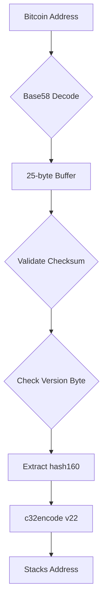

# Bitcoin to Stacks Address Converter (Clarity)

A Clarity smart contract that converts **legacy Bitcoin addresses** (P2PKH/P2SH) to [Stacks blockchain addresses](https://www.stacks.co/) using Base58 decoding and c32 encoding.

[](https://docs.stacks.co/docs/clarity/language-functions)

## Features
- ✅ Base58 decoding of Bitcoin addresses
- ✅ Checksum validation (double SHA-256)
- ✅ Version byte verification (supports 0x00 and 0x05)
- ✅ c32check encoding for Stacks addresses
- 🛠 Error handling with specific error codes

## Usage

### Requirements
- Clarity 2.1+ compatible environment
- [Clarinet](https://docs.hiro.so/clarinet/) (for local testing)

### Function Signature
```clarity
(define-public (btc->stacks (btc-address (string-ascii 35)))
```

### Example
Convert a Bitcoin address to Stacks address:
```clarity
(btc->stacks "1A1zP1eP5QGefi2DMPTfTL5SLmv7DivfNa")
;; Returns: "SP3JW6WS8R2G7H9X6ZJF7N8TSNYGE5MZBPG4WZ4FH"
```

### Error Codes
| Code | Description                     |
|------|---------------------------------|
| u1   | Invalid Base58 character        |
| u2   | Non-Base58 characters in input  |
| u5   | Checksum mismatch               |
| u6   | Unsupported version byte        |
| u100 | General decoding error          |

## Limitations
- ❌ Does NOT support Bech32 addresses (starts with `bc1`)
- ❌ Testnet Bitcoin addresses not supported
- ⚠ Always validate addresses before use in production

## Development

### Test Cases
Add these to your Clarinet test file:
```typescript
// Valid P2PKH address
assertEquals(
  contract.btc->stacks("1A1zP1eP5QGefi2DMPTfTL5SLmv7DivfNa"),
  ok("SP3JW6WS8R2G7H9X6ZJF7N8TSNYGE5MZBPG4WZ4FH")
);

// Invalid checksum
assertEquals(
  contract.btc->stacks("1A1zP1eP5QGefi2DMPTfTL5SLmv7DivfNb"),
  err(u5)
);
```

### Build Steps
1. Clone repository:
   ```bash
   git clone https://github.com/YOUR_USERNAME/bitcoin-to-stacks-converter.git
   ```
2. Start Clarinet console:
   ```bash
   clarinet console
   ```
3. Call conversion function:
   ```clarity
   (contract-call? .btc-converter btc->stacks "BTC_ADDRESS_HERE")
   ```

## How It Works


## License
[MIT](LICENSE) © 2025 Faith-C-Nwokoro

## Acknowledgements
- [Stacks Documentation](https://docs.stacks.co/)
- [Base58 Encoding Spec](https://en.bitcoin.it/wiki/Base58Check_encoding)
- [c32check Reference](https://github.com/stacks-network/c32check)
